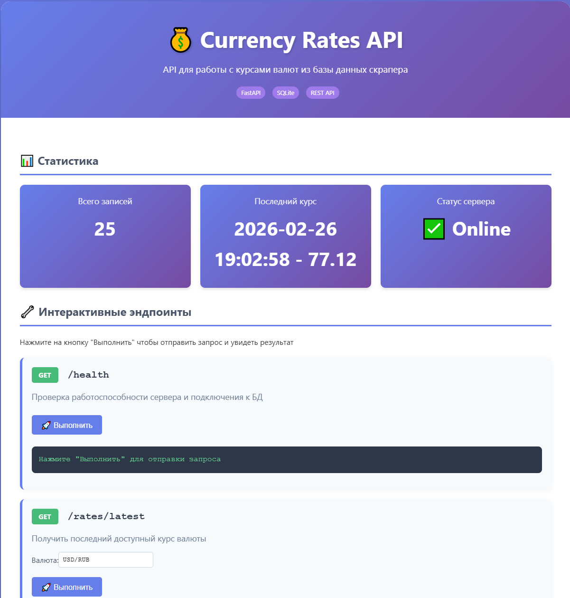
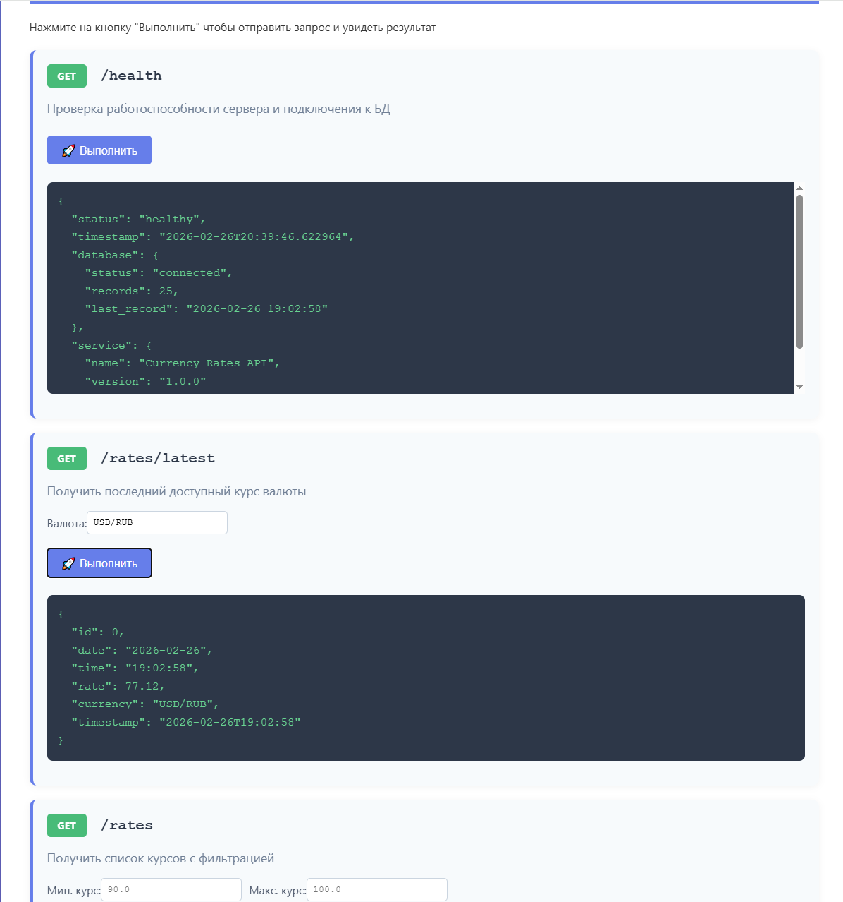
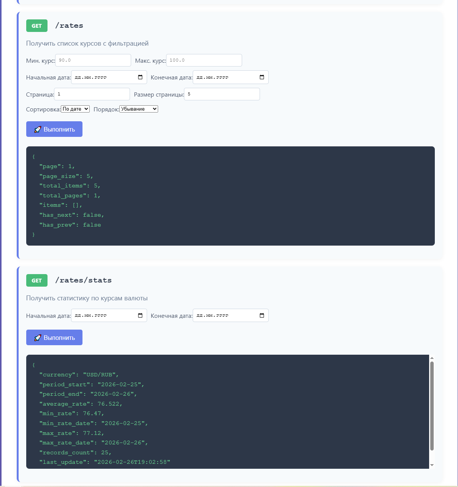
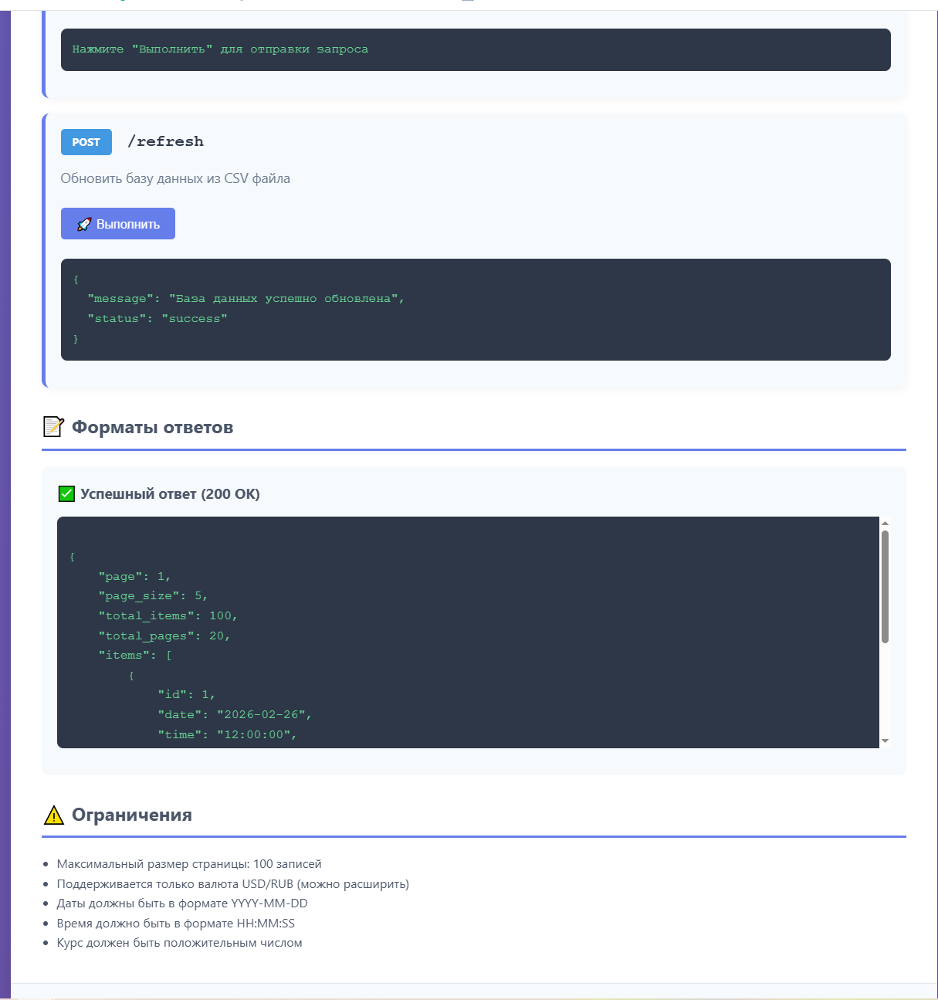

💰 Currency Rates API
API для получения курсов валют из базы данных скрапера. Проект предоставляет удобный интерфейс для работы с историческими данными курса USD/RUB с возможностью фильтрации, сортировки и пагинации.

🚀 Установка и запуск
Предварительные требования
Python 3.9 или выше

pip (менеджер пакетов Python)

Пошаговая инструкция
Клонируйте репозиторий

bash
git clone https://github.com/yourusername/currency-api.git
cd currency-api
Создайте виртуальное окружение (рекомендуется)

bash
# Windows
python -m venv venv
venv\Scripts\activate

# Linux/Mac
python3 -m venv venv
source venv/bin/activate
Установите зависимости

bash
pip install -r requirements.txt
Подготовьте данные

Поместите файл usd_rate.csv в корневую папку проекта

Формат CSV должен содержать колонки: Дата,Время,Курс USD/RUB,Timestamp

Пример содержимого:

csv
Дата,Время,Курс USD/RUB,Timestamp
2026-02-25,19:02:04,76.47,2026-02-25 19:02:04
2026-02-25,20:02:06,76.47,2026-02-25 20:02:06
Запустите сервер

bash
python main.py
Откройте в браузере

text
http://localhost:8000
📁 Структура проекта
text
currency-api/
├── main.py              # Основной файл FastAPI приложения
├── database.py          # Работа с CSV и SQLite
├── models.py            # Pydantic модели данных
├── requirements.txt     # Зависимости проекта
├── usd_rate.csv        # Данные курсов валют
├── currency.db         # SQLite база данных (создается автоматически)
└── README.md           # Документация проекта
Модули
main.py - содержит все эндпоинты API и веб-интерфейс

database.py - реализует три класса для работы с данными:

CSVStorage - чтение/запись CSV файла

DatabaseStorage - работа с SQLite (одно соединение)

CurrencyService - бизнес-логика и валидация

models.py - Pydantic модели для валидации запросов/ответов

🔌 API Эндпоинты
📊 Получение данных
GET /health
Проверка работоспособности сервера и подключения к БД.

bash
curl http://localhost:8000/health
Ответ:

json
{
  "status": "healthy",
  "timestamp": "2026-02-26T15:30:45.123456",
  "database": {
    "status": "connected",
    "records": 1250,
    "last_record": "2026-02-26 15:30:00"
  },
  "service": {
    "name": "Currency Rates API",
    "version": "1.0.0"
  }
}
GET /rates/latest
Получить последний доступный курс валюты.

currency (опционально) - валюта (по умолчанию USD/RUB)

bash
curl "http://localhost:8000/rates/latest?currency=USD/RUB"
Ответ:

json
{
  "id": 42,
  "date": "2026-02-26",
  "time": "15:30:00",
  "rate": 77.12,
  "currency": "USD/RUB",
  "timestamp": "2026-02-26T15:30:00"
}
GET /rates
Получить список курсов с фильтрацией, сортировкой и пагинацией.

Параметры:

Параметр	Тип	Описание	По умолчанию
start_date	date	Начальная дата (YYYY-MM-DD)	None
end_date	date	Конечная дата (YYYY-MM-DD)	None
min_rate	float	Минимальный курс	None
max_rate	float	Максимальный курс	None
currency	string	Валюта	"USD/RUB"
sort_by	string	Поле сортировки (date/time/rate)	"date"
sort_order	string	Порядок (asc/desc)	"desc"
page	int	Номер страницы	1
page_size	int	Размер страницы (1-100)	50
Пример:

bash
curl "http://localhost:8000/rates?start_date=2026-02-25&end_date=2026-02-26&min_rate=76.0&page=1&page_size=10"
Ответ:

json
{
  "page": 1,
  "page_size": 10,
  "total_items": 25,
  "total_pages": 3,
  "items": [
    {
      "id": 45,
      "date": "2026-02-26",
      "time": "15:30:00",
      "rate": 77.12,
      "currency": "USD/RUB",
      "timestamp": "2026-02-26T15:30:00"
    }
  ],
  "has_next": true,
  "has_prev": false
}
GET /rates/stats
Получить статистику по курсам валюты.

start_date (опционально) - начальная дата

end_date (опционально) - конечная дата

currency (опционально) - валюта

bash
curl "http://localhost:8000/rates/stats?start_date=2026-02-01&end_date=2026-02-26"
Ответ:

json
{
  "currency": "USD/RUB",
  "period_start": "2026-02-01",
  "period_end": "2026-02-26",
  "average_rate": 76.89,
  "min_rate": 76.47,
  "min_rate_date": "2026-02-25",
  "max_rate": 77.12,
  "max_rate_date": "2026-02-26",
  "records_count": 1250,
  "last_update": "2026-02-26T15:30:00"
}
📝 Управление данными
POST /rates
Добавить новый курс в базу данных.

date_str (обязательно) - дата в формате YYYY-MM-DD

time_str (обязательно) - время в формате HH:MM:SS

rate (обязательно) - курс

currency (опционально) - валюта

bash
curl -X POST "http://localhost:8000/rates?date_str=2026-02-26&time_str=16:00:00&rate=77.50"
Ответ:

json
{
  "message": "Курс успешно добавлен",
  "status": "success"
}
POST /refresh
Обновить базу данных из CSV файла (перезаписывает существующие данные).

bash
curl -X POST http://localhost:8000/refresh
Ответ:

json
{
  "message": "База данных успешно обновлена",
  "status": "success"
}
💻 Примеры использования
Python (requests)
python
import requests

BASE_URL = "http://localhost:8000"

# Получить последний курс
response = requests.get(f"{BASE_URL}/rates/latest")
print(response.json())

# Получить курсы с фильтрацией
response = requests.get(
    f"{BASE_URL}/rates",
    params={
        "start_date": "2026-02-25",
        "end_date": "2026-02-26",
        "min_rate": 76.0,
        "page_size": 5
    }
)
print(response.json())

# Получить статистику
response = requests.get(
    f"{BASE_URL}/rates/stats",
    params={
        "start_date": "2026-02-01",
        "end_date": "2026-02-26"
    }
)
print(response.json())

# Добавить новый курс
response = requests.post(
    f"{BASE_URL}/rates",
    params={
        "date_str": "2026-02-26",
        "time_str": "16:30:00",
        "rate": 77.25
    }
)
print(response.json())

curl
bash
# Получить последний курс
curl http://localhost:8000/rates/latest

# Получить курсы за последние 2 дня
curl "http://localhost:8000/rates?start_date=2026-02-25&end_date=2026-02-26"

# Получить статистику
curl "http://localhost:8000/rates/stats"

# Добавить курс
curl -X POST "http://localhost:8000/rates?date_str=2026-02-26&time_str=17:00:00&rate=77.30"
📊 Форматы данных
CSV файл
csv
Дата,Время,Курс USD/RUB,Timestamp
2026-02-25,19:02:04,76.47,2026-02-25 19:02:04
2026-02-25,20:02:06,76.47,2026-02-25 20:02:06
SQLite таблица
sql
CREATE TABLE currency_rates (
    id INTEGER PRIMARY KEY AUTOINCREMENT,
    timestamp TEXT NOT NULL,
    rate REAL NOT NULL,
    currency TEXT NOT NULL DEFAULT 'USD/RUB'
);
⚙️ Разработка
Запуск в режиме разработки
bash
python main.py

Скриншоты работы:

